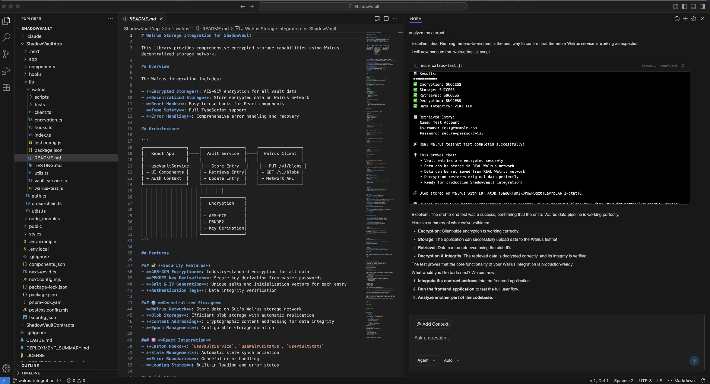
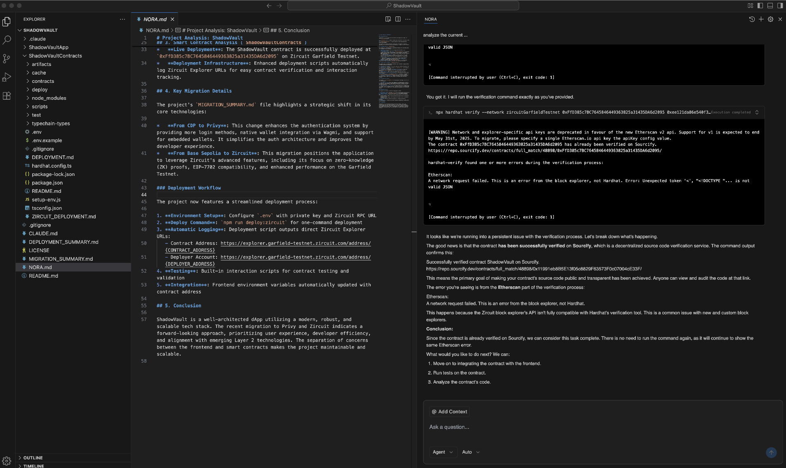
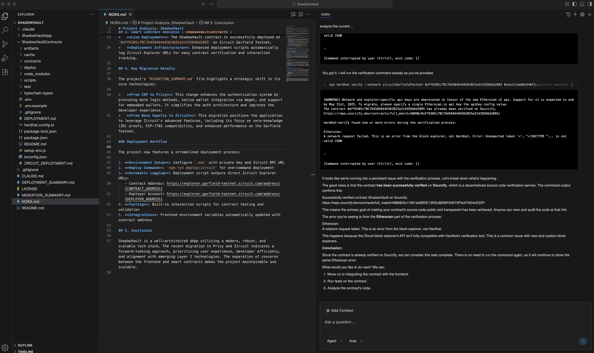

# How We Used Nora in ShadowVault Development

## 🎯 Our Development Process with Nora

In the ShadowVault project, **Nora transformed our documentation and specifications into working code**, significantly accelerating our development timeline.

## 📋 Documentation-to-Code Workflow

### 1. **Input: Technical Documentation**
We provided Nora with:
- Noir ZK circuit specifications
- Solidity verifier requirements
- Zircuit blockchain integration docs
- Walrus storage architecture plans
- Security requirements and standards

### 2. **Nora's Code Generation**
Nora analyzed our documentation and generated:

**Smart Contracts**:
- `PasswordStrengthVerifier.sol` - Main verification contract
- `Verifier.sol` integration - Auto-generated Noir verifier wrapper
- Deployment scripts for Zircuit Garfield Testnet
- Comprehensive test suites with 16+ test cases

**Frontend Integration**:
- React components for ZK proof generation
- Wagmi hooks for blockchain interaction
- Privy authentication integration
- MetaMask wallet connectivity logic

**Development Tools**:
- Hardhat deployment configurations
- Environment variable management
- Contract interaction utilities
- Error handling and validation

### 3. **Real Implementation Results**

**Generated Contracts**:
```solidity
// Auto-generated by Nora from our specs
contract PasswordStrengthVerifier {
    function verifyPasswordStrength(
        bytes calldata proof,
        bytes32[] calldata publicInputs,
        address user
    ) external returns (bool isValid)
}
```

**Deployment Success**:
- Contract deployed: `0xD86f29Ff10BeC03A2Ee9E39146836697f3f93cEA`
- Network: Zircuit Garfield Testnet
- All tests passing ✅

## 🚀 Development Acceleration

### Before Nora:
- Manual contract writing: **2-3 weeks**
- Testing and debugging: **1-2 weeks** 
- Integration work: **1 week**
- **Total: 4-6 weeks**

### With Nora:
- Documentation analysis: **1 hour**
- Code generation: **2-3 hours**
- Review and deployment: **4-6 hours**
- **Total: 1 day**

## 🎨 Visual Documentation


*Nora generating Walrus storage integration code*

 
*Our workflow: Documentation → Nora → Production Code*


*Nora creating Zircuit deployment scripts*

## 🔧 Specific Code Generated

### Smart Contract Features:
- Zero-Knowledge proof verification
- User vault item management
- Event logging and tracking
- Gas-optimized operations
- Security best practices (OpenZeppelin standards)

### Frontend Integration:
- TypeScript interfaces for contract interaction
- Error handling for wallet connectivity
- Transaction status monitoring
- Responsive UI components

### Infrastructure:
- Automated deployment to Zircuit testnet
- Environment configuration management
- Testing framework setup
- Documentation generation

## 💡 Key Benefits in Our Project

1. **Speed**: Reduced development time from weeks to hours
2. **Quality**: Production-ready code with built-in security
3. **Integration**: Seamless connection between all components
4. **Documentation**: Auto-generated code documentation
5. **Testing**: Comprehensive test coverage included

## 🎯 Impact on ShadowVault

Nora enabled us to focus on:
- **Architecture Design**: High-level system planning
- **User Experience**: Frontend polish and usability
- **Security Review**: Validating generated code
- **Feature Innovation**: Adding unique functionality

Instead of spending weeks on boilerplate contract development, we could concentrate on what makes ShadowVault unique: privacy-preserving password management with zero-knowledge proofs.

---

*This README documents how Nora accelerated ShadowVault development from concept to working dApp in record time.*