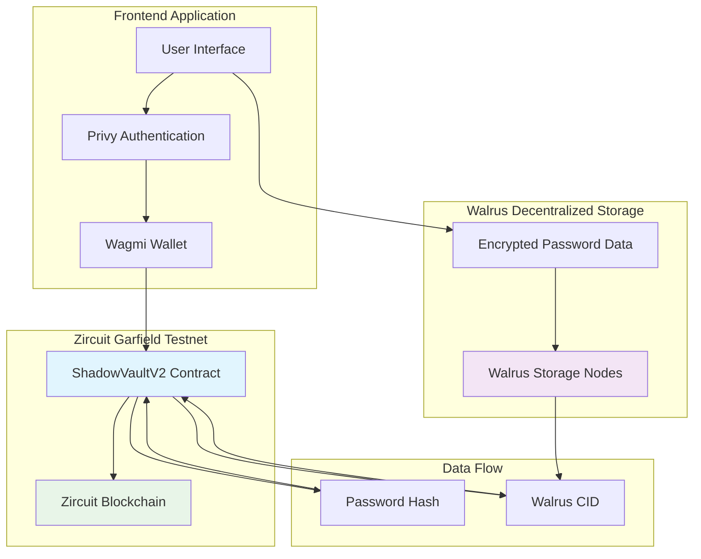
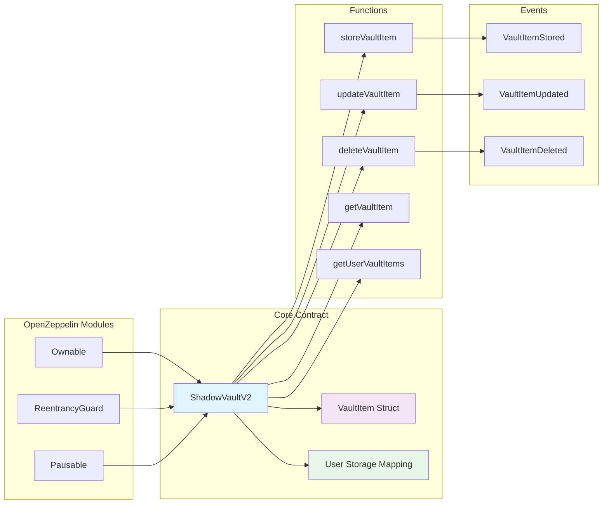
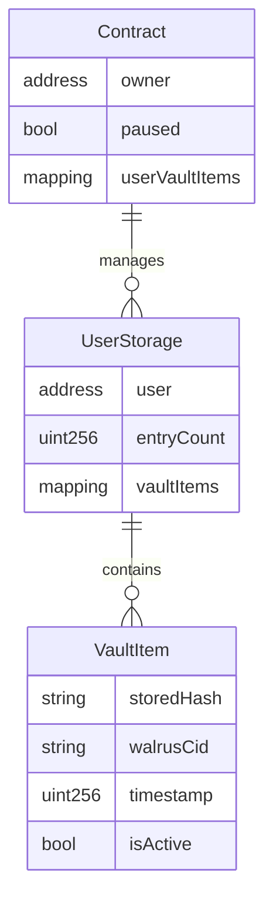
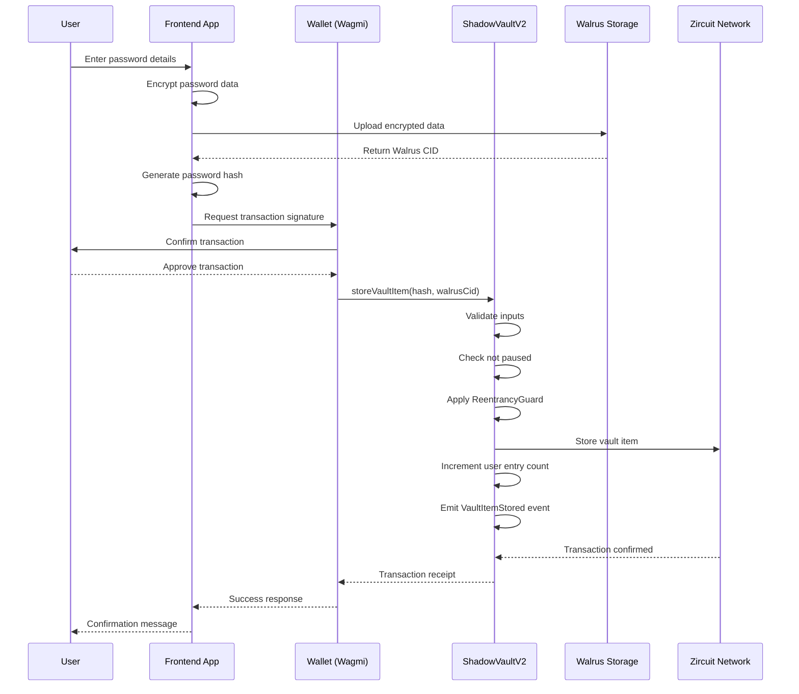
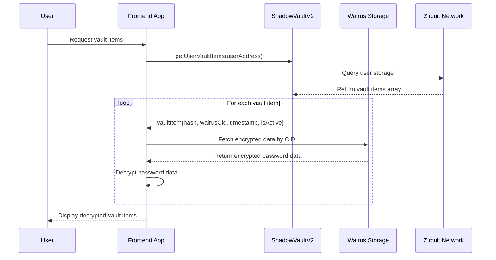
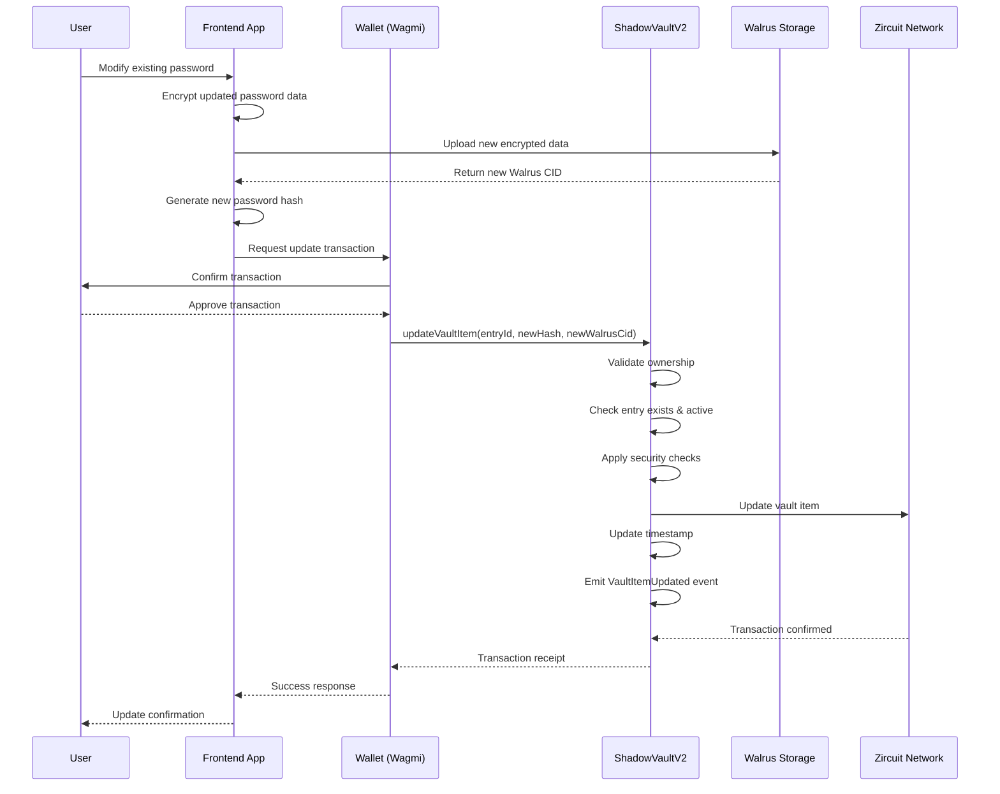
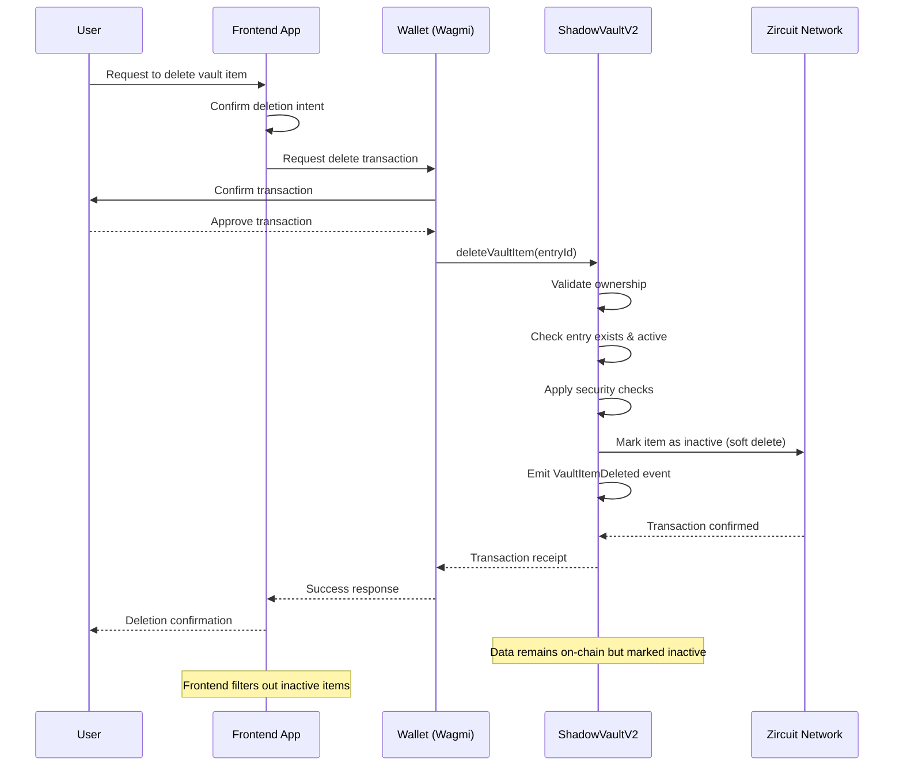
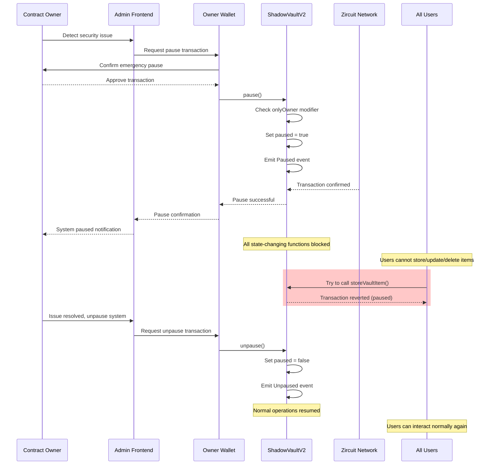

# ShadowVault Smart Contracts

A secure, privacy-first password manager smart contract system built for Zircuit Garfield Testnet with OpenZeppelin standards and Walrus decentralized storage integration.

## 🚀 Live Deployment

### ShadowVaultV2 Contract
- **Contract Address**: `0x577dc63554BF7531f75AF602896209fFe87d51E8`
- **Network**: Zircuit Garfield Testnet
- **Chain ID**: 48898
- **Explorer**: [View on Zircuit Explorer](https://explorer.garfield-testnet.zircuit.com/address/0x577dc63554BF7531f75AF602896209fFe87d51E8)
- **Deployment Tx**: [0x80077...](https://explorer.garfield-testnet.zircuit.com/tx/0x80077613a7943f4833743104f0884d14575624cd0d9bd146c5479760ed9df5a3)

### What This Contract Does

ShadowVaultV2 is a secure password management contract that stores encrypted password data with Walrus decentralized storage integration. Key features:

- **Secure Storage**: Stores password hashes and Walrus CIDs (Content IDs) for encrypted data
- **User Isolation**: Each user can only access their own vault items
- **Walrus Integration**: Uses Walrus decentralized storage for off-chain encrypted data
- **OpenZeppelin Security**: Built with industry-standard security practices (Ownable, ReentrancyGuard, Pausable)
- **Gas Optimized**: Efficient storage structure for cost-effective operations

#### Core Functions
- `storeVaultItem(string storedHash, string walrusCid)` - Store new encrypted password entry
- `updateVaultItem(uint256 entryId, string storedHash, string walrusCid)` - Update existing entry
- `deleteVaultItem(uint256 entryId)` - Mark entry as deleted (soft delete)
- `getVaultItem(address user, uint256 entryId)` - Retrieve specific entry
- `getUserVaultItems(address user)` - Get all active entries for a user

#### Data Structure
```solidity
struct VaultItem {
    string storedHash;      // Hash of the password
    string walrusCid;       // Walrus blob ID (CID)
    uint256 timestamp;      // Creation/update timestamp
    bool isActive;          // Active status
}
```

## 🚀 Features

- **Secure Storage**: Encrypted password data stored on-chain
- **Zero-Knowledge Privacy**: Only encrypted hashes stored, never plaintext
- **OpenZeppelin Standards**: Built with industry-standard security practices
- **Access Control**: Owner-based administrative functions
- **Pausable Operations**: Emergency pause functionality
- **Reentrancy Protection**: Built-in protection against reentrancy attacks
- **Gas Optimized**: Efficient storage and operations

## 📦 Contract Architecture

### System Architecture Overview



### ShadowVaultV2 Contract Components



### Data Structure



### Main contract implementing secure password storage with the following features:

- **Entry Management**: Store, update, and delete encrypted password entries with Walrus CIDs
- **User Isolation**: Each user's data is completely isolated
- **Walrus Integration**: Off-chain encrypted data storage with on-chain CID references
- **Access Control**: Owner-only administrative functions
- **Security Features**: Pausable, ReentrancyGuard, and proper validation

## 🔄 Workflow Sequential Diagrams

### Store Vault Item Workflow



### Retrieve Vault Item Workflow



### Update Vault Item Workflow



### Delete Vault Item Workflow



### Emergency Pause Workflow (Owner Only)



## 🛠 Prerequisites

- Node.js >= 16.x
- npm or yarn
- Hardhat
- Zircuit Garfield testnet access
- Testnet ETH (can use Sepolia faucets as Zircuit uses Sepolia ETH)

## 🔧 Installation

```bash
# Clone the repository and navigate to contracts
cd ShadowVaultContracts

# Install dependencies
npm install

# Copy environment template
cp .env.example .env
```

## ⚙️ Configuration

Edit `.env` file with your credentials:

```env
# Private key for deployment (without 0x prefix)
PRIVATE_KEY=your_private_key_here

# Zircuit RPC URL (optional, defaults to public RPC)
ZIRCUIT_RPC_URL=https://garfield-testnet.zircuit.com

# Enable gas reporting
REPORT_GAS=false
```

## 🔨 Development Commands

### Build & Test

```bash
# Compile contracts
npm run build

# Run tests
npm run test

# Run tests with gas reporting
npm run gas-report

# Generate coverage report
npm run coverage

# Clean artifacts
npm run clean
```

### Deployment

```bash
# Deploy to Zircuit Garfield Testnet
npm run deploy:zircuit

# Verify contract with Sourcify (manual process)
npm run sourcify:manual

# Interact with deployed contract
npm run interact:zircuit <contract_address>
```

## 📋 Deployment Process

1. **Prepare Environment**
   ```bash
   # Ensure you have testnet ETH (use Sepolia faucets)
   # Configure .env file with PRIVATE_KEY
   ```

2. **Deploy Contract**
   ```bash
   npm run deploy:zircuit
   ```

3. **Verify with Sourcify**
   ```bash
   npm run sourcify:manual
   # Follow instructions in sourcify-verification/INSTRUCTIONS.md
   ```

4. **Test Deployment**
   ```bash
   npm run interact:zircuit <contract_address>
   ```

## 🔐 Security Features

### OpenZeppelin Integration

- **Ownable**: Administrative access control
- **ReentrancyGuard**: Protection against reentrancy attacks
- **Pausable**: Emergency pause functionality

### Data Protection

- **Encrypted Storage**: Only encrypted data stored on-chain
- **Hash-based Metadata**: Service names and usernames as hashes
- **User Isolation**: Complete separation of user data
- **Input Validation**: Comprehensive validation of all inputs

### Access Control

- **Owner Functions**: pause/unpause operations
- **User Functions**: CRUD operations on own data only
- **No Cross-User Access**: Users cannot access others' data

## 📊 Gas Optimization

The contract is optimized for gas efficiency:

- Efficient storage layout
- Batch operations where possible
- Minimal external calls
- Optimized loops and data structures

## 🧪 Testing

Comprehensive test suite covering:

- **Deployment**: Correct initialization
- **Entry Management**: CRUD operations
- **Access Control**: Owner and user permissions
- **Security**: Pause functionality and input validation
- **Edge Cases**: Error conditions and boundary cases

```bash
npm run test
```

## 📖 API Reference

### Core Functions

#### `storeVaultItem(string calldata storedHash, string calldata walrusCid)`
Store a new encrypted password entry with Walrus CID.

#### `updateVaultItem(uint256 entryId, string calldata storedHash, string calldata walrusCid)`
Update an existing vault item.

#### `deleteVaultItem(uint256 entryId)`
Mark a vault item as deleted (soft delete).

#### `getVaultItem(address user, uint256 entryId)`
Retrieve a specific vault item.

#### `getUserVaultItems(address user)`
Get all active vault items for a user.

### Administrative Functions

#### `pause()` / `unpause()`
Owner-only functions to pause/unpause contract operations.

## 🌐 Network Configuration

### Zircuit Garfield Testnet

- **Chain ID**: 48898
- **RPC URL**: https://garfield-testnet.zircuit.com
- **Explorer**: https://explorer.garfield-testnet.zircuit.com
- **Faucet**: Use Sepolia faucets (Zircuit uses Sepolia ETH)
- **Features**: ZK-optimized, EIP-7702 compatible, Pectra opcodes

## 📝 License

This project is licensed under the MIT License.

## 🤝 Contributing

1. Fork the repository
2. Create a feature branch
3. Make your changes
4. Add tests for new functionality
5. Run the test suite
6. Submit a pull request

## 🔗 Useful Links

- [Hardhat Documentation](https://hardhat.org/docs)
- [OpenZeppelin Contracts](https://docs.openzeppelin.com/contracts)
- [Zircuit Documentation](https://docs.zircuit.com/)
- [Zircuit Explorer](https://explorer.garfield-testnet.zircuit.com)
- [Walrus Documentation](https://docs.walrus.sui.io/)

## 🆘 Troubleshooting

### Common Issues

1. **Deployment Fails**
   - Check private key is correct (no 0x prefix)
   - Ensure sufficient testnet ETH (use Sepolia faucets)
   - Verify network configuration

2. **Verification Fails**
   - Use Sourcify manual verification process
   - Ensure contract source files are available
   - Check contract address and chain ID

3. **Tests Fail**
   - Run `npm run clean` and rebuild
   - Check Node.js version compatibility
   - Ensure all dependencies are installed

### Getting Help

- Check existing GitHub issues
- Review Hardhat documentation
- Check Zircuit Discord community
- Use Sourcify for contract verification